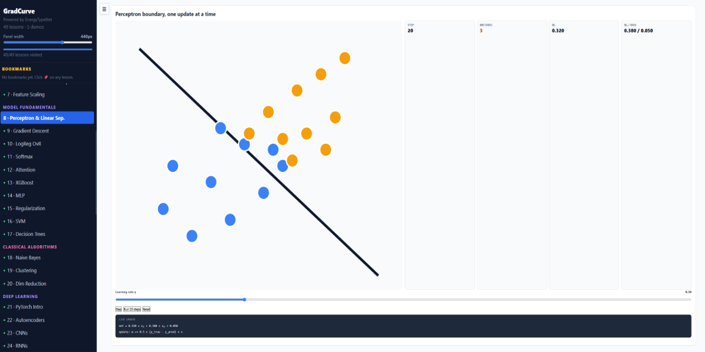

# GradCurve — ML Explained Through a Real Project

**[Live site →](https://bartoszbryg.github.io/GradCurve/)**

Most ML courses teach concepts in isolation. GradCurve teaches them through
a single real project — a building energy classifier — from raw CSV all the
way to production deployment. Every lesson connects to actual source code,
important formulas include relevant interactive visualizations, and a
58-question exam checks whether it stuck.



---

## Who it is for

Students who finished an ML course and want to see how everything connects
in one real codebase. Not a course replacement — a companion for when you
are staring at someone else's code and wondering why it was written that way.

---

## What is inside

**49 lessons** across two tracks:

*ML fundamentals* — dataset loading, feature engineering, scaling, logistic
regression, regularization, SVM, decision trees, kNN, naive Bayes,
dimensionality reduction, clustering, neural networks, autoencoders,
PyTorch, CNNs, RNNs, ensembles, gradient descent, overfitting

*Production engineering* — MLflow, FastAPI, Docker, Streamlit, GitHub
Actions CI, AutoML, SHAP and LIME explainability, data validation,
model cards, LLM streaming

**14 interactive visualizations** — move a slider and watch the formula
value, the chart, and the model output all change at once.

**5 browser demos** — including a live in-browser classifier that trains
three models on synthetic data with no Python server.

**58-question final exam** and a **101-term searchable glossary**.

---

## The project it teaches

EnergyTypeNet: https://github.com/bartoszbryg/EnergyTypeNet

30 custom NumPy model implementations, 19 notebooks, FastAPI service,
Docker deployment, MLflow tracking, Streamlit dashboard, SHAP and LIME
explainability. Covers all 20 topics of a standard ML course syllabus
plus the production engineering story.

---

## Running locally

```bash
pip install flask
python build.py
# Open http://localhost:5000
```

No npm. No build step. Static HTML + CDN React 18 + plain JavaScript.

---

## Adding a lesson

1. Add a `NAV` entry in `src/app.jsx`
2. Add a `LESSON_IDX` mapping in `src/app.jsx`
3. Push content to `window.BLOCKS[n]` in `src/lesson-content/*.js`
4. Add the script tag in `index.html` in load order

---

*Built alongside the EnergyTypeNet ML portfolio project.*
